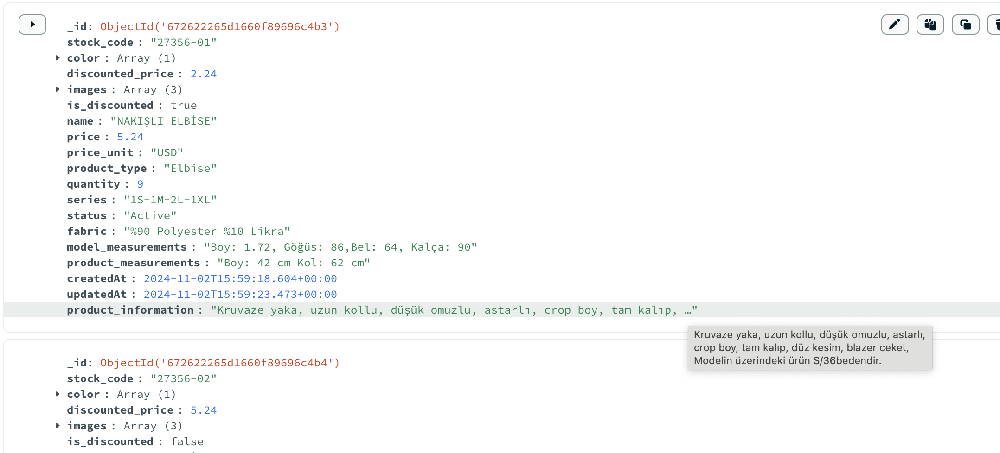
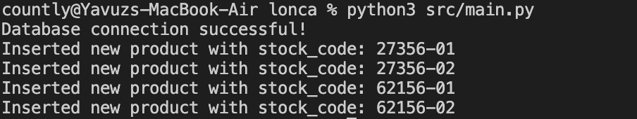
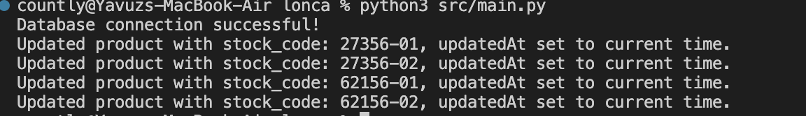

# Product XML Parser

This project is a Python application designed to read, parse, and store product information from XML files into a MongoDB database. The primary focus is on extracting relevant product details, including pricing, measurements, and fabric information.

## Requirements

To run this project, you need to have the following installed:

- Python 3.7 or higher
- MongoDB (local or cloud instance)
- Required Python packages

## Getting Started

Follow these steps to set up the project on your local machine:

### 1. Clone the Repository

Open your terminal and run the following command to clone the repository:

```bash
git clone https://github.com/YavuzYilmazz/product-extracter.git
cd product-extracter
```

### Install Required Packages


```bash
pip install pymongo python-dotenv
```

or 

```bash
pip3 install pymongo python-dotenv
```

### Set Up Environment Variables

Copy the provided .env.dist file to a new file named .env in the root directory of the project:

```bash
cp .env.dist .env
```

Open the .env file in a text editor and update the following variables:

```bash
MONGO_URI=<your_mongo_uri>
DATABASE_NAME=<your_database_name>
COLLECTION_NAME=<your_collection_name>
```

### Place Your XML Files

Ensure you have your example XML files ready. Update the path in main.py where the XML file is referenced. Make sure the XML file is placed correctly, following the defined path in your code.

### Run the Application

Once you have set everything up, you can run the application using:


```bash
python src/main.py
```

or


```bash
python3 src/main.py
```

### File Directory Structure
```bash
product-extracter/
│
├── src/
│   ├── main.py          # Main entry point for the application
│   ├── config.py        # Database configuration and connection handling
│   └── classes/
│       ├── reader.py    # XML reading and parsing logic
│       ├── extractor.py  # Extractor classes for parsing product details
│       └── product.py    # Product class definition using dataclass
└── .env.dist            # Template for environment variables
```


### Results
```json
[{
  "_id": {
    "$oid": "67261cb398bc6819c3db2e8f"
  },
  "stock_code": "27356-01",
  "color": [
    "Turuncu"
  ],
  "discounted_price": 2.24,
  "images": [
    "www.aday-butik-resim-sitesi/27356-turuncu-1.jpeg",
    "www.aday-butik-resim-sitesi/27356-turuncu-2.jpeg",
    "www.aday-butik-resim-sitesi/27356-turuncu-3.jpeg"
  ],
  "is_discounted": true,
  "name": "NAKIŞLI ELBİSE",
  "price": 5.24,
  "price_unit": "USD",
  "product_type": "Elbise",
  "quantity": 9,
  "series": "1S-1M-2L-1XL",
  "status": "Active",
  "fabric": "%90 Polyester %10 Likra",
  "model_measurements": "Boy: 1.72, Göğüs: 86,Bel: 64, Kalça: 90",
  "product_measurements": "Boy: 42 cm Kol: 62 cm",
  "createdAt": "2024-11-02T15:36:03.943960",
  "updatedAt": "2024-11-02T15:36:03.943963",
  "product_information": "Kruvaze yaka, uzun kollu, düşük omuzlu, astarlı, crop boy, tam kalıp, düz kesim, blazer ceket, Modelin üzerindeki ürün S/36bedendir."
},
{
  "_id": {
    "$oid": "67261cb398bc6819c3db2e90"
  },
  "stock_code": "27356-02",
  "color": [
    "Sarı"
  ],
  "discounted_price": 5.24,
  "images": [
    "www.aday-butik-resim-sitesi/27356-sarı-1.jpeg",
    "www.aday-butik-resim-sitesi/27356-sarı-2.jpeg",
    "www.aday-butik-resim-sitesi/27356-sarı-3.jpeg"
  ],
  "is_discounted": false,
  "name": "NAKIŞLI ELBİSE",
  "price": 5.24,
  "price_unit": "USD",
  "product_type": "Elbise",
  "quantity": 0,
  "series": "1S-1M-1L-1XL",
  "status": "Active",
  "fabric": "%100 Pamuklu",
  "model_measurements": "Boy: 1.74, Göğüs: 85, Bel: 64, Kalça: 91",
  "product_measurements": "Boy: 62 cm",
  "createdAt": "2024-11-02T15:36:03.944158",
  "updatedAt": "2024-11-02T15:36:03.944159",
  "product_information": "v yaka, kısa kollu, pamuklu, terletmez, iç göstermez, parlak kumaş, standart boy, düz kesim, tan kalıp, gri tişört, Modelin üzerindeki ürün S/36 bedendir."
},
{
  "_id": {
    "$oid": "67261cb398bc6819c3db2e91"
  },
  "stock_code": "62156-01",
  "color": [
    "Ekru"
  ],
  "discounted_price": 0,
  "images": [
    "www.aday-butik-resim-sitesi/62156-ekru-1.jpeg",
    "www.aday-butik-resim-sitesi/62156-ekru-2.jpeg",
    "www.aday-butik-resim-sitesi/62156-ekru-3.jpeg"
  ],
  "is_discounted": true,
  "name": "Büzgü Kollu T-shirt",
  "price": 3.24,
  "price_unit": "USD",
  "product_type": "T-shirt",
  "quantity": 0,
  "series": "1M-1L-1XL",
  "status": "Active",
  "fabric": "",
  "model_measurements": "Boy: 1.73, Kilo: 50, Göğüs: 87, Bel: 63, Kalça: 88",
  "product_measurements": "",
  "createdAt": "2024-11-02T15:36:03.944252",
  "updatedAt": "2024-11-02T15:36:03.944254",
  "product_information": "Yuvarlak yaka, ince askılı, yanı büzgülü, bağcık detaylı, terletmez, likralı kumaş, dar kalıp, dar kesim, crop"
},
{
  "_id": {
    "$oid": "67261cb398bc6819c3db2e92"
  },
  "stock_code": "62156-02",
  "color": [
    "Vizon"
  ],
  "discounted_price": 1.24,
  "images": [
    "www.aday-butik-resim-sitesi/62156-vizon-1.jpeg",
    "www.aday-butik-resim-sitesi/62156-vizon-2.jpeg",
    "www.aday-butik-resim-sitesi/62156-vizon-3.jpeg"
  ],
  "is_discounted": true,
  "name": "Büzgü Kollu T-shirt",
  "price": 3.24,
  "price_unit": "USD",
  "product_type": "T-shirt",
  "quantity": 0,
  "series": "1M-1L-1XL",
  "status": "Active",
  "fabric": "Triko",
  "model_measurements": "Boy: 1.73, Kilo: 50, Göğüs: 87, Bel: 63, Kalça: 88",
  "product_measurements": "",
  "createdAt": "2024-11-02T15:36:03.944285",
  "updatedAt": "2024-11-02T15:36:03.944286",
  "product_information": "Polo yaka, düğmeli, göğüs ve sırt dekolteli, likralı, triko kumaş, likralı, crop boy, dar kalıp, dar kesim, bluz"
}]

```


Here are some examples of product images:







The images above are samples of the products stored in the database.